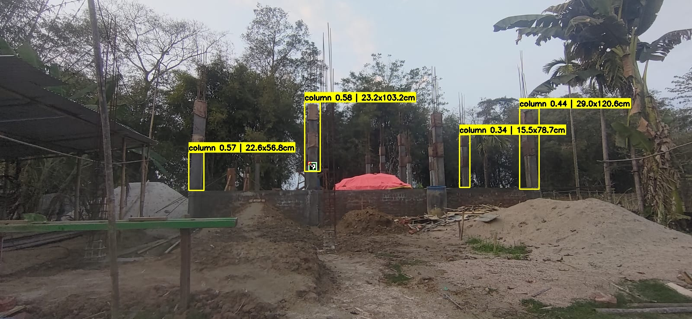

# 🏗️ Construction Element Detection API

> AI-powered construction site detection with automatic dimension measurement using YOLOv8 fine-tuned model and ArUco marker calibration.


---

## 📌 Overview

This project detects construction elements (columns, beams, walls, doors, windows, floors, stairs) from images and automatically measures their **width and height in centimeters** using an ArUco marker placed on a hard hat for scale calibration.

**Live API:** `https://newtechdevng-construction-detection-api.hf.space`

---

## 📸 Detection in Action

> Real construction site — columns detected with auto-calibrated dimensions via ArUco marker on hard hat



*4 columns detected with real-world cm dimensions — ArUco marker auto-calibrated the scale*

---

## 🎯 Model Performance

| Model | mAP50 | mAP50-95 |
|-------|-------|----------|
| V2 Original | 0.626 | 0.508 |
| V3 YOLO11m | 0.626 | 0.447 |
| **Fine-tuned V2 (ours)** | **0.695** 🏆 | **0.522** |

### Per-Class Results

| Class | Precision | Recall | mAP50 | Improvement |
|-------|-----------|--------|-------|-------------|
| window | 0.783 | 0.883 | 0.858 | +56% 🔥 |
| floor | 0.824 | 0.653 | 0.722 | +43% 🔥 |
| beam | 0.728 | 0.591 | 0.654 | +54% 🔥 |
| door | 0.811 | 0.723 | 0.736 | stable ✅ |
| wall | 0.692 | 0.619 | 0.647 | stable ✅ |
| stairs | 0.768 | 0.609 | 0.625 | stable ✅ |
| column | 0.778 | 0.544 | 0.620 | stable ✅ |

---

## 🚀 Features

- ✅ Detects **7 construction elements** in a single image
- ✅ **Auto-calibration** via ArUco marker on hard hat — no manual setup per photo
- ✅ Returns **width & height in cm** for every detected element
- ✅ Returns **annotated image** with bounding boxes and labels
- ✅ Fast inference — ~0.35s per image
- ✅ REST API built with **FastAPI**, hosted on **Hugging Face Spaces**

---

## 🧱 Detected Classes

| Class | Color |
|-------|-------|
| 🟡 Column | Cyan |
| 🟡 Beam | Orange |
| 🟡 Wall | Blue |
| 🟡 Door | Magenta |
| 🟡 Window | Purple |
| 🟡 Floor | Green |
| 🟡 Stairs | Yellow |

---

## 📐 How Calibration Works

```
👷 ArUco sticker (10cm × 10cm) on hard hat in scene
                ↓
📷 Camera detects marker → measures it in pixels
                ↓
pixels_per_cm = marker_px / 10cm
                ↓
📏 All detected objects measured using the same ratio
```

**Steps:**
1. Print the ArUco marker at exactly **10cm × 10cm**
2. Laminate it and stick on a hard hat
3. Ensure the hard hat is visible in every photo
4. The API auto-calibrates and returns real-world cm dimensions ✅

---

## 🔌 API Reference

**Base URL:** `https://newtechdevng-construction-detection-api.hf.space`

### `GET /health`
Check if the API and model are running.

**Response:**
```json
{
  "status": "ok",
  "model": "best_v2_finetune.pt"
}
```

---

### `POST /detect`
Upload an image and get detections with dimensions.

**Parameters (form-data):**

| Field | Type | Default | Description |
|-------|------|---------|-------------|
| `file` | File | required | Image file (jpg/png) |
| `marker_size_cm` | float | 10.0 | Real size of ArUco marker in cm |
| `confidence` | float | 0.2 | Detection confidence threshold |
| `iou` | float | 0.3 | IoU threshold for NMS |

**Response:**
```json
{
  "success": true,
  "calibrated": true,
  "pixels_per_cm": 5.5,
  "inference_time_s": 0.344,
  "total": 6,
  "detections": [
    {
      "class": "column",
      "confidence": 0.87,
      "bbox": [701, 237, 742, 439],
      "width_px": 41,
      "height_px": 202,
      "width_cm": 23.2,
      "height_cm": 103.1
    }
  ],
  "image_base64": "<annotated image as base64>"
}
```

---

## 🧪 Quick Test

```python
import requests, base64

API_URL    = "https://newtechdevng-construction-detection-api.hf.space"
IMAGE_PATH = "your_construction_image.jpg"

with open(IMAGE_PATH, "rb") as f:
    response = requests.post(
        f"{API_URL}/detect",
        files={"file": f},
        data={"marker_size_cm": 10.0, "confidence": 0.2}
    )

result = response.json()
print(f"Calibrated: {result['calibrated']}")
print(f"Detections: {result['total']}")

for det in result["detections"]:
    print(f"  → {det['class']} | W: {det['width_cm']}cm | H: {det['height_cm']}cm")

# Save annotated image
with open("result.jpg", "wb") as f:
    f.write(base64.b64decode(result["image_base64"]))
```

---

## 🛠️ Local Setup

```bash
# Clone the repo
git clone https://github.com/newtechdevng/construction-detection-api
cd construction-detection-api

# Create virtual environment
python -m venv myenv
myenv\Scripts\activate  # Windows
source myenv/bin/activate  # Mac/Linux

# Install dependencies
pip install -r requirements.txt

# Run locally
python app.py
```

---

## 📦 Tech Stack

| Component | Technology |
|-----------|------------|
| Object Detection | YOLOv8 (Ultralytics) fine-tuned |
| Calibration | OpenCV ArUco markers |
| API Framework | FastAPI |
| Model Hosting | Hugging Face Model Hub |
| API Hosting | Hugging Face Spaces (Docker) |
| Mobile App | React Native (coming soon) |

---

## 📁 Project Structure

```
construction-detection-api/
├── app.py                  # FastAPI application
├── Dockerfile              # Docker config for HF Spaces
├── requirements.txt        # Python dependencies
├── README.md               # This file
└── test/
    ├── test_api.py         # Basic API test
    ├── aruco_test.py       # ArUco calibration test
    └── generate_marker.py  # Generate ArUco sticker
```

---

## 🖨️ Generate ArUco Marker

```python
import cv2
import numpy as np

aruco_dict = cv2.aruco.getPredefinedDictionary(cv2.aruco.DICT_4X4_50)
marker_img = cv2.aruco.generateImageMarker(aruco_dict, 0, 500)

bordered = np.ones((600, 600), dtype=np.uint8) * 255
bordered[50:550, 50:550] = marker_img

cv2.imwrite("hardhat_aruco_sticker.png", bordered)
print("Print at exactly 10cm x 10cm!")
```

---

## 🗺️ Roadmap

- [x] Fine-tune YOLOv8 model (mAP50: 0.695)
- [x] Deploy FastAPI on Hugging Face Spaces
- [x] ArUco marker auto-calibration
- [x] Real-world cm dimension measurement
- [ ] React Native mobile app
- [ ] Multi-marker support for better accuracy
- [ ] 3D depth estimation (Depth Anything v2)
- [ ] BIM/CAD export integration

---

## 🤝 Contributing

Pull requests are welcome! For major changes, please open an issue first.

---

## 📄 License

MIT License — free to use and modify.

---

## 🙏 Acknowledgements

- [Ultralytics YOLOv8](https://github.com/ultralytics/ultralytics)
- [Hugging Face Spaces](https://huggingface.co/spaces)
- [OpenCV ArUco](https://docs.opencv.org/4.x/d5/dae/tutorial_aruco_detection.html)
- [FastAPI](https://fastapi.tiangolo.com)